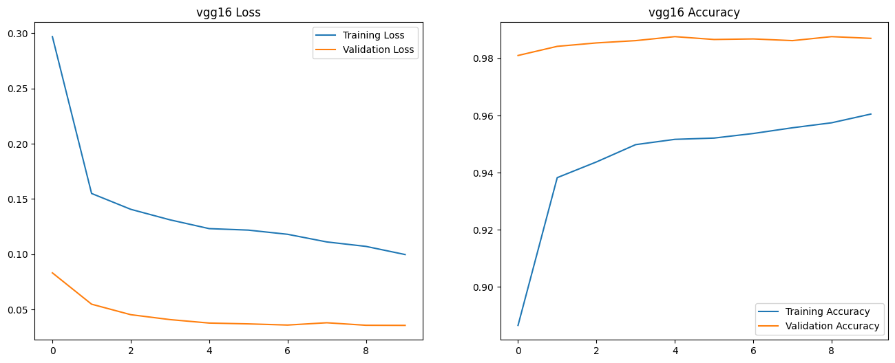

# VGG19 Image Classification

This project implements a VGG19 model for binary image classification, specifically for distinguishing between cats and dogs. The model is trained using PyTorch and includes data preprocessing, model definition, training, and evaluation.

## Table of Contents

- [Introduction](#introduction)
- [Dataset](#dataset)
- [Model Architecture](#model-architecture)
- [Training](#training)
- [Results](#results)
- [Submission](#submission)
- [Requirements](#requirements)
- [License](#license)

## Introduction

The VGG19 model is a convolutional neural network that has shown great success in image classification tasks. This implementation focuses on binary classification, utilizing transfer learning techniques to achieve high accuracy.

## Dataset
The dataset used for training and validation is organized into two directories:
- `datasets/train`: Contains training images.
- `datasets/val`: Contains validation images.

The images are labeled as either cats (0) or dogs (1).

## Model Architecture

The model summary can be found in `model_summary.txt`, which provides detailed information about each layer, output shapes, and the number of parameters.

### Model Summary
- Total params: 21,439,810 (81.79 MB)
- Trainable params: 6,672,898 (25.46 MB)
- Non-trainable params: 14,766,912 (56.33 MB)

## Training

The training process involves:
- Loading the dataset using `keras.utils.image_dataset_from_directory`.
- Applying transformations such as resizing, normalization, and data augmentation.
- Using the CrossEntropyLoss criterion and SGD optimizer.
- Training the model for a specified number of epochs.

The training loop includes validation after each epoch to monitor performance.

## Results

The training and validation loss and accuracy are visualized in the following plots:

The model achieved a validation accuracy of approximately 76.80% after the first epoch.

## Submission

The predictions for the test dataset are saved in `submission.csv`, which contains the following columns:
- `id`: The identifier for each image.
- `label`: The predicted class (0 for cat, 1 for dog).

